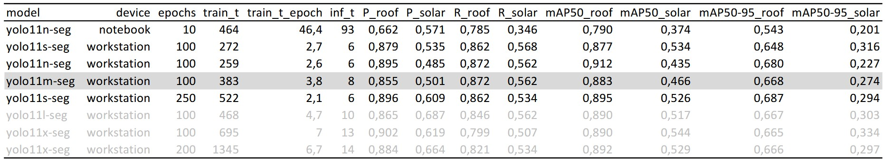

# One-Pager for submission
this project is made as submission for the lecture [Intelligent Production Systems](https://mciwing.github.io/). The code can be found on [GitHub](https://github.com/ThoAus/yolo_aerial_image_segmentation.git)

## Purpose
On the aereal image the following objects has to be indentified and marked with a segmentation mask.
- Buildings
- Solar plants, in most of the cases installed on building roofs

The data should be saved in a format for further anaysis in the open Source GIS software [QGIS](https://qgis.org/download/).

## Dataset
The source of the aereal image is the "Autonome Provinz Bozen - Südtirol". The aereal image is aviable in a resolution of 20cm per pixel on a WMS-Service. The aereal images are aviable via the Website [MapView](https://mapview.civis.bz.it/) in this resolution and quality are aviable aereal images for the years:

- 'p_bz-Orthoimagery:Aerial-2011-RGB-20CM'
- 'p_bz-Orthoimagery:Aerial-2014-RGB'
- 'p_bz-Orthoimagery:Aerial-2015-RGB'
- 'p_bz-Orthoimagery:Aerial-2017-RGB'
- 'p_bz-Orthoimagery:Aerial-2020-RGB'
- 'p_bz-Orthoimagery:Aerial-2023-RGB'

To train the model 250 images are downloaded in the size 640 x 640 pixel at locations with different kinds of vegetation and building styles from the aereal image of the year 2023 using the Notebook [01_Dataset.ipynb](/01_Dataset.ipynb) and the library [owslib](https://owslib.readthedocs.io/en/latest/usage.html#wms). The annotation was done using [label-studio](https://labelstud.io/). There are annotated the segmentation masks for the class 'roof' and 'solar'. The dataset is split randomly to 200 images for training and 50 images for validation (proportion 20/80). The total annotated aerea is 640 x 640 pixel * 0,2 m/pixel = 16.384 m² * 250 images = 4.096.000 m² = 4,1 km². In the 50 images of the validation set are present 195 instances of class roof and 73 instances of class solar.

## Model
The framework used ist [YOLO](https://docs.ultralytics.com/). The To resolve the task training on all avialbe YOLO11 segmentation models is performed on a workstation with a Intel Xenon Silver 4218R CPU, 128 GB memory and two GPU Nvidia RTX A5000 with 24 GB memory each. The training is performed in [02_Training.ipynb](/02_Training.ipynb) for 100 epochs with the default hyperparameters. The training and inference is also performed on a notebbok wit a AMD Ryzen Pro 7840HS CPU and 32GB memory without dedicated GPU. In the following table the results are shown

For further analys the model 'yolo11m-seg' trained for 100 epochs is used, in the metrics there are no big differences between the models are recogabialbe. It woud be better to compare the example images.

## Use in QGIS

for the use of the trained model in QGIS the following two ways are taken in concern. To work directly on the data and because of difficults getting the desired output fomat the second way 'PNG with world-file' is implementet for this work.

### Plugin Deepness
The QGIS pluging [Deepness]() is made for the simple usage of AI-models on geodata. The model has to be made in ONNX format and give as output a tensor with shape [n_classes, width, height]. the plugin applies the model on a given input layer in raster format and save the segmentation masks as polygons.

### PNG with world-file
There are defined two simple functions in [xxx](xxx) to perform the following tasks:

- download the image from wMS service and save the world-file, a standardized file with information abaut the location of the image in a directory. the areal image can be eather stored in the same directory or returned as PIL image for further processing
- make prediction with a given yolo-model and PIl image as input and store the prediction as png file

The png files then can be loaded in QGIS for furth processing and analyzing. On the example image below the proportion of bebaung for the whole area of the 'Marktgemeinde Lana' is visualized.

## Problems and  Improvements
There are the following improvements wich can be optimized in further work

- There are reconized apple fields as solar plants and streets as buildings. With mor training data and augmentation during training process the problem shuold be solved or be better
- an the edges the objects are not detected well, in most cases a row of one pixel is empty. this could be done better having an overlap between images
- 

## Conclusion

this is a quick and simple implementation to use yolo for segmentation of aereal images. with different training data it is als possible to detect other objects wich can be trees, pools, apple fields.

