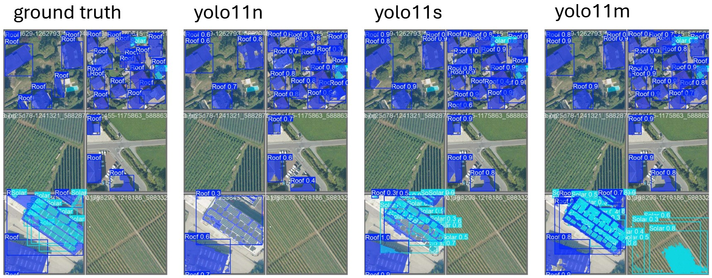
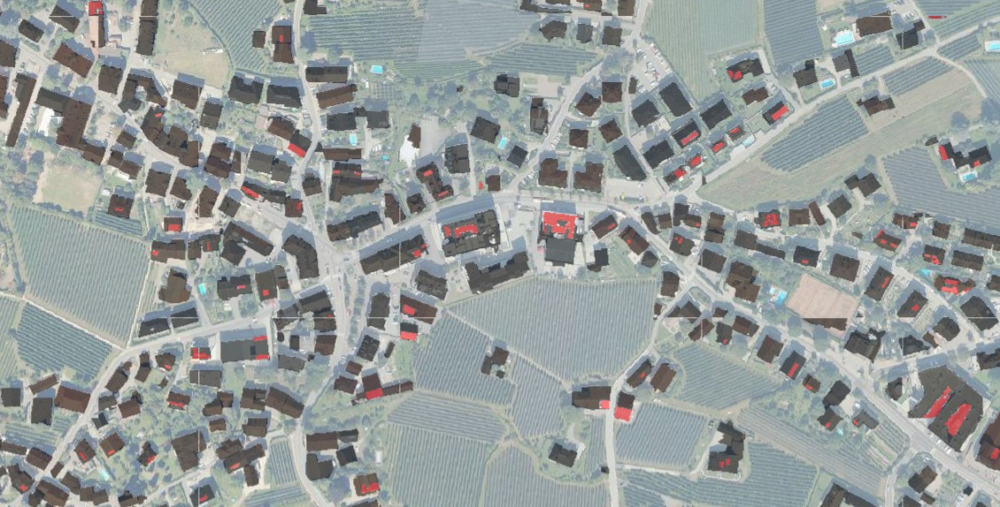

# One-Pager for Submission

This project was created as a submission for the lecture [Intelligent Production Systems](https://mciwing.github.io/). The code is available in the linked [GitHub Repository](https://github.com/ThoAus/yolo_aerial_image_segmentation.git).

## Purpose

In the aerial images, the following objects must be identified and marked with segmentation masks:
- Buildings
- Solar plants, in most cases installed on building roofs

The data should be saved in a format suitable for further analysis in the open-source GIS software [QGIS](https://qgis.org/download/).

## Dataset

The source of the aerial images is the 'Autonome Provinz Bozen - Südtirol'. The images are available at a resolution of 20 cm per pixel via a WMS service. These images can be accessed through the website [MapView](https://mapview.civis.bz.it/), with the following datasets available:

- 'p_bz-Orthoimagery:Aerial-2011-RGB-20CM'
- 'p_bz-Orthoimagery:Aerial-2014-RGB'
- 'p_bz-Orthoimagery:Aerial-2015-RGB'
- 'p_bz-Orthoimagery:Aerial-2017-RGB'
- 'p_bz-Orthoimagery:Aerial-2020-RGB'
- 'p_bz-Orthoimagery:Aerial-2023-RGB'

To train the model, 250 images of size 640 x 640 pixels were downloaded from various locations with different vegetation and building styles, using the 2023 dataset and the notebook [01_Dataset.ipynb](/01_Dataset.ipynb) with the [owslib](https://owslib.readthedocs.io/en/latest/usage.html#wms) library. Annotation was performed using [label-studio](https://labelstud.io/), with segmentation masks for the classes 'roof' and 'solar'. The dataset was randomly split into 200 images for training and 50 images for validation (80/20 split). The total annotated area is 640 x 640 pixels * 0.2 m/pixel = 16,384 m² per image, totaling 4,096,000 m² (4.1 km²) for 250 images. In the 50 validation images, there are 195 instances of the 'roof' class and 73 instances of the 'solar' class.

## Model

The framework used is [YOLO](https://docs.ultralytics.com/). All available YOLO11 segmentation models were trained on a workstation with an Intel Xeon Silver 4218R CPU, 128 GB RAM, and two Nvidia RTX A5000 GPUs (24 GB each). Training was performed in [02_Training.ipynb](/02_Training.ipynb) for 100 epochs with default hyperparameters. Training and inference were also tested on a notebook with an AMD Ryzen Pro 7840HS CPU and 32 GB RAM without a dedicated GPU. The results are shown in the table below.

For further analysis, the model 'yolo11m-seg' trained for 100 epochs was used, as there were no significant differences in metrics between the models. Visual comparison of example images is more informative. In the following image, three models are compared visually. A brief inspection shows that the model 'yolo11m' performs best at detecting the relevant regions, but it also produces some false positives, such as detecting a solar plant where none exists.

## Use in QGIS

For the integration of the trained model in QGIS, two approaches were considered. Due to challenges in obtaining the desired output format directly, the second approach using 'PNG files with world files' was implemented in this project.

### Deepness Plugin

The QGIS plugin [Deepness](https://qgis-plugin-deepness.readthedocs.io/en/latest/) enables straightforward application of AI models to geospatial data. The model must be exported in ONNX format and should output a tensor with shape [n_classes, width, height]. The plugin applies the model to a given raster input layer and saves the resulting segmentation masks as polygons.

### PNG with World File

Two simple functions are defined in [05_Use_model_to_predict.ipynb](/05_Use_model_to_predict.ipynb) to perform the following tasks:

- Download the image from a WMS service and save the corresponding world file, which contains standardized georeferencing information. The aerial image can either be stored in the same directory or returned as a PIL image for further processing.
- Generate predictions using a specified YOLO model and a PIL image as input, and save the resulting segmentation mask as a PNG file.

The resulting PNG files can then be loaded into QGIS for further processing and analysis, as illustrated in the image below. Buildings are shown in black, and solar plants are shown in red.

## Problems and Improvements

The following improvements could be addressed in future work:

- Apple orchards are sometimes recognized as solar plants, and streets as buildings. With more training data and data augmentation during training, this issue should be mitigated. Improving image augmentation during training could also help.
- At the edges, objects are not detected well; in most cases, a row of one pixel is missing. This could be improved by introducing overlap between images by a specific number of pixels.

## Conclusion

This is a quick and simple implementation of YOLO for segmentation of aerial images. With different training data, it is also possible to detect other objects such as trees, pools, or apple orchards. It would be interesting to compare the results with conventional segmentation methods, such as using a U-Net.